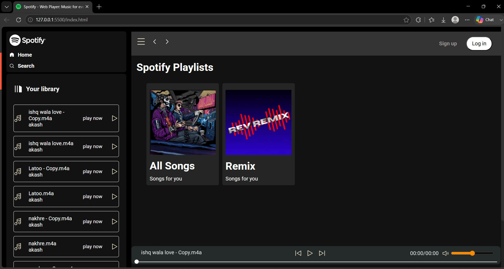
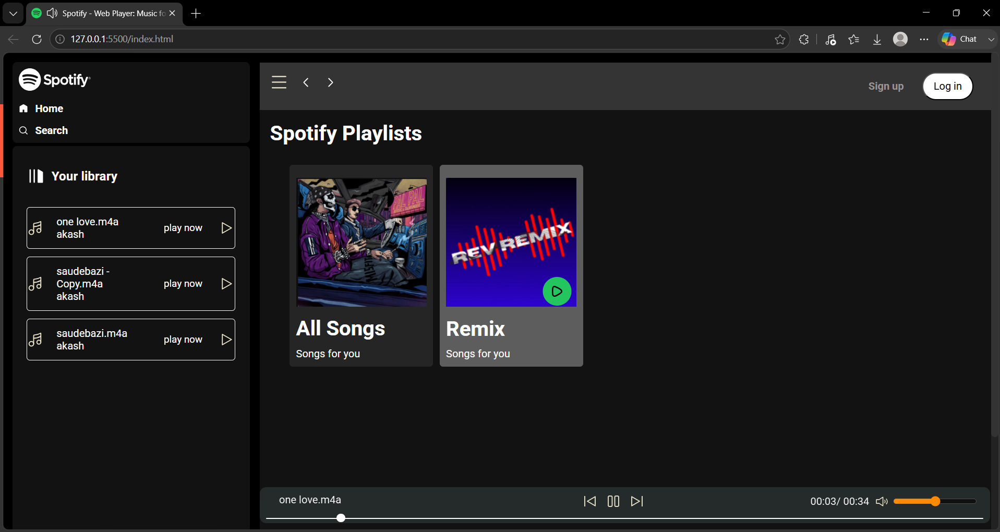
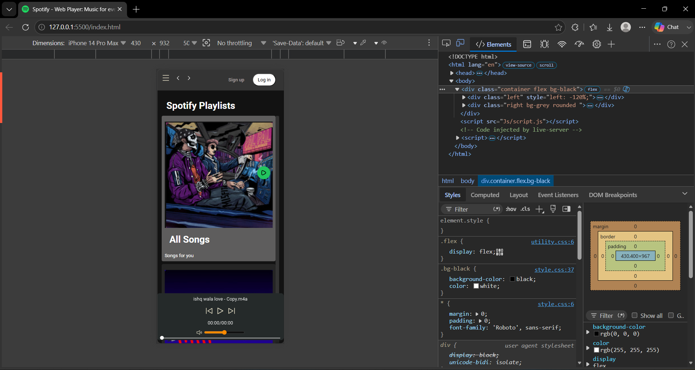
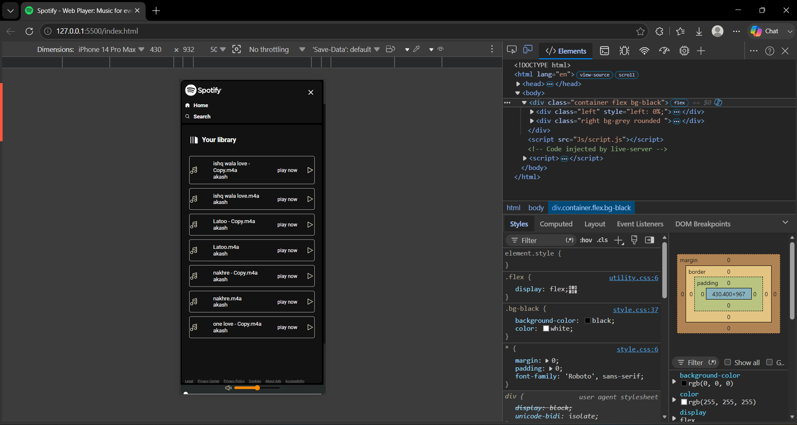

# 🎵 Spotify Clone

A responsive Spotify-inspired music player built using **HTML, CSS, and JavaScript**. This project replicates the basic look and feel of Spotify with playlist browsing, music playback controls, and a responsive design for desktop and mobile devices.

## 🚀 Features

- 🎧 Play, Pause, Next & Previous controls
- 📂 Playlist and song library
- 🔊 Volume control
- ⏱️ Music progress bar with current time
- 📱 Responsive design for mobile and desktop
- 🎨 Spotify-inspired UI
- 📂 Dynamic song loading using JavaScript

---

## 🛠️ Tech Stack

- HTML5
- CSS3
- JavaScript (ES6)

---

## 📸 Screenshots

### 💻 Desktop View



*Home page with playlists and music player.*

---

### ▶️ Music Playing



*Music playback with controls, timer, and volume.*

---

### 📱 Mobile Responsive View



*Responsive layout optimized for mobile devices.*

---

### 📂 Mobile Sidebar



*Sliding sidebar showing the music library.*

---

## 📂 Folder Structure

```text
Spotify-Clone/
│── index.html
│── css/
│   ├── style.css
│   └── utility.css
│── js/
│   └── script.js
│── songs/
│── img/
│── screenshots/
│── README.md
```

---

## ⚙️ Installation

```bash
git clone https://github.com/imakasx/spotify-clone.git
cd spotify-clone
```

Open `index.html` in your browser.

---

## 🎯 Future Improvements

- Search functionality
- Shuffle & Repeat
- Login page
- Backend integration
- User playlists
- Music API integration

---
